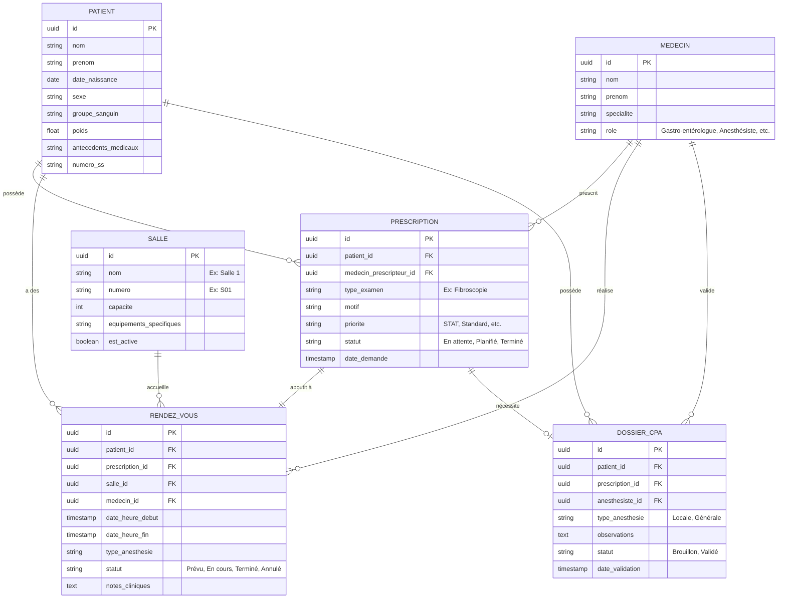

# Schéma de Base de Données - Application Endoscopie CHU

Voici une proposition de schéma de base de données relationnelle (type PostgreSQL / MySQL) déduit à partir des interfaces et des workflows de l'application (Prescriptions, Planification, CPA, Agenda, Gestion des Salles).

## Diagramme Entité-Association (ERD)

## Description détaillée des tables

### 1. Table `PATIENT`
Contient les informations démographiques et médicales de base des patients.
- **id** (UUID) : Identifiant unique.
- **nom** (String) : Nom du patient.
- **prenom** (String) : Prénom.
- **date_naissance** (Date) : Date de naissance.
- **sexe** (String) : Sexe.
- **groupe_sanguin** (String) : Groupe sanguin (ex: A+).
- **poids** (Float) : Poids (kg) utile pour l'anesthésie.
- **antecedents_medicaux** (Text) : Liste ou JSON des antécédents (hypertension, allergies).

### 2. Table `MEDECIN` (ou `PERSONNEL`)
Contient les professionnels de santé.
- **id** (UUID)
- **nom**, **prenom** (String)
- **specialite** (String) : Service d'appartenance (Gastro-entérologie, Anesthésie, etc.)
- **role** (String) : Rôle dans l'application pour la gestion des droits.

### 3. Table `PRESCRIPTION` (Fil de Prescription)
Représente une demande d'examen créée par un médecin.
- **id** (UUID)
- **patient_id** (UUID - FK)
- **medecin_prescripteur_id** (UUID - FK)
- **type_examen** (String) : Motif médical (Ex: Coloscopie).
- **priorite** (String) : Niveau d'urgence (Standard, Urgent, **STAT**).
- **statut** (String) : État de la demande (ex: À planifier, Planifié).

### 4. Table `SALLE`
Gère les blocs opératoires et salles d'examen.
- **id** (UUID)
- **nom** (String) : Nom d'affichage (ex: Salle 1).
- **capacite** (Int) : Nombre de patients/lits.
- **equipements_specifiques** (String) : Ex: "Appareil RX Mobile".
- **est_active** (Boolean) : Permet de désactiver "Salle 2" sans la supprimer de l'historique.

### 5. Table `DOSSIER_CPA` (Consultation Pré-Anesthésique)
Demande spécifique envoyée au service d'anesthésie.
- **id** (UUID)
- **prescription_id** (UUID - FK) : Liée à la demande initiale.
- **anesthesiste_id** (UUID - FK) : Le médecin validant la CPA.
- **type_anesthesie** (String) : Locale, Générale.
- **statut** (String) : Brouillon, En attente, Validé.

### 6. Table `RENDEZ_VOUS` (Agenda / Planification)
Créé lorsque le créneau est confirmé depuis l'interface de planification.
- **id** (UUID)
- **prescription_id** (UUID - FK)
- **salle_id** (UUID - FK) : La salle assignée.
- **date_heure_debut** (Timestamp) : Horodatage du RDV.
- **date_heure_fin** (Timestamp) : Durée estimée ou réelle de l'examen.
- **statut** (String) : Prévu, Confirmé, En cours, Complété.
